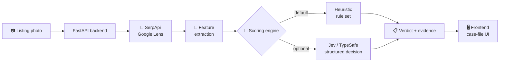

<div align="center">

# 🔍 PhotoCheck

### Catch a reused rental photo before you pay a deposit for it.

[](https://www.python.org/)
[](https://fastapi.tiangolo.com/)
[](https://serpapi.com/)
[]()
[]()

**Built for the SerpApi India Hackathon 2026 · Track: AI Agents**

</div>

---

## 📖 Table of contents

- [🧩 The problem](#-the-problem)
- [💡 The idea](#-the-idea)
- [⚙️ How it works](#️-how-it-works)
- [🏗️ Architecture](#️-architecture)
- [🧠 Scoring engine](#-scoring-engine)
- [📊 Judging criteria fit](#-judging-criteria-fit)
- [🚀 Quick start](#-quick-start)
- [📁 Project structure](#-project-structure)
- [🗺️ Roadmap](#️-roadmap)
- [⚠️ Known limitations (v1)](#️-known-limitations-v1)

---

## 🧩 The problem

> Every rental season, brokers across India repost the **same listing photo**
> under different addresses, different cities, and different names — to
> collect deposits for flats that don't exist, aren't available, or aren't
> what's pictured.

Renters — especially students and first-time movers — have **no way to check
this themselves** before sending money. There is no existing tool for it.

## 💡 The idea

**PhotoCheck** takes a single listing photo and tells you, in seconds:

- 🔁 Has this exact photo shown up in other listings?
- 🌍 Are those listings in *other cities*, far from where this one claims to be?
- 🕰️ How old is the earliest copy — is this a stale, recycled photo?
- 🧾 What's the evidence — direct links, not just a score to blindly trust

## ⚙️ How it works

| Step | What happens |
|:---:|---|
| 1️⃣ | User submits a listing photo (upload or URL) + optional claimed city |
| 2️⃣ | 🔎 **SerpApi Google Lens** finds every other page on the web using that image |
| 3️⃣ | 🧮 Raw matches are distilled into structured signals — match count, distinct domains, cities mentioned, geographic spread |
| 4️⃣ | 🧠 A scoring layer turns those signals into a verdict, with a confidence score and plain-English reasoning |
| 5️⃣ | 📋 The result is shown as a **case file** — verdict + every piece of visual evidence, linked and dated |

## 🏗️ Architecture



## 🧠 Scoring engine

The decision layer is **pluggable by design**, chosen via one environment
variable — this is what turns the project from "an API wrapper" into a real
decision system:

| Backend | Speed | Needs extra key? | Notes |
|---|:---:|:---:|---|
| 🟢 **Heuristic** *(default)* | Instant | No | Transparent, hand-written rules — explainable line-by-line |
| 🟣 **Jev** *(optional)* | ~70–500ms | Yes ([TypeSafe](https://typesafe.ai/) early access) | Calibrated, type-safe structured decisions in place of hand-written rules |

If Jev isn't configured or a call fails, the app **silently falls back** to
the heuristic — the demo never breaks because of a missing key.

## 📊 Judging criteria fit

| Criterion | How this project addresses it |
|---|---|
| 💡 **Idea strength** | Solves a specific, common, financially painful problem — not a vague concept |
| 🎯 **Originality** | Uses Google **Lens** (reverse image search) — a SerpApi surface almost no one else touches |
| 🛠️ **Technical complexity** | Multi-signal pipeline: retrieval (Lens) → feature extraction → pluggable decision engine, not a single API passthrough |
| ✅ **Usefulness** | Directly prevents real financial loss for a huge, underserved population |
| 🔗 **Meaningful SerpApi usage** | The product is **structurally non-functional** without live Lens search |

## 🚀 Quick start

```bash
# 1. Backend
cd backend
cp .env.example .env        # add your SerpApi key
pip install -r requirements.txt
uvicorn main:app --reload

# 2. Frontend
# just open frontend/index.html in a browser
```

> ⚠️ SerpApi's Lens engine needs a **public** image URL — see
> [`README.md`](./README.md) for the ngrok/deploy workaround needed for
> local demos.

## 📁 Project structure

```
📦 photocheck
 ┣ 📂 backend
 ┃ ┣ 🐍 main.py            → FastAPI app · POST /api/analyze
 ┃ ┣ 🐍 lens_client.py      → SerpApi Google Lens wrapper
 ┃ ┣ 🐍 scorer.py           → Feature extraction + heuristic/Jev scoring
 ┃ ┣ 📄 requirements.txt
 ┃ ┗ 🔑 .env.example
 ┣ 📂 frontend
 ┃ ┗ 🖥️ index.html          → Single-file UI, zero build step
 ┣ 📘 README.md             → Setup & run instructions
 ┣ 🤖 AGENT_BUILD_INSTRUCTIONS.md → Full spec for a coding agent to extend this
 ┗ ✨ PhotoCheck-Overview.md → You are here
```

## 🗺️ Roadmap

- [x] 🔎 Lens-based reverse image search
- [x] 🧮 Heuristic multi-signal scorer
- [x] 🖥️ Case-file style UI
- [ ] 🗺️ Maps-based geo cross-check (claimed address vs. visible landmarks)
- [ ] 🧠 Live Jev integration (pending TypeSafe early access)
- [ ] ☁️ Public deployment for a zero-setup demo link

## ⚠️ Known limitations (v1)

- Heuristic scoring only — Jev path is stubbed, not live yet
- No geo cross-check yet (Maps signal planned, not required for v1)
- Uploaded images are stored unauthenticated on the backend disk — fine for
  a demo, **not** for production
- City detection uses a short hardcoded list of major Indian cities, not a
  full gazetteer/NER model

---

<div align="center">

Built with 🔎 <a href="https://serpapi.com">SerpApi</a> for the SerpApi India Hackathon 2026

</div>
